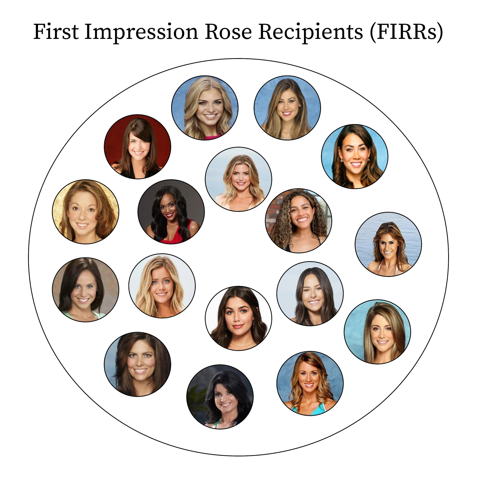
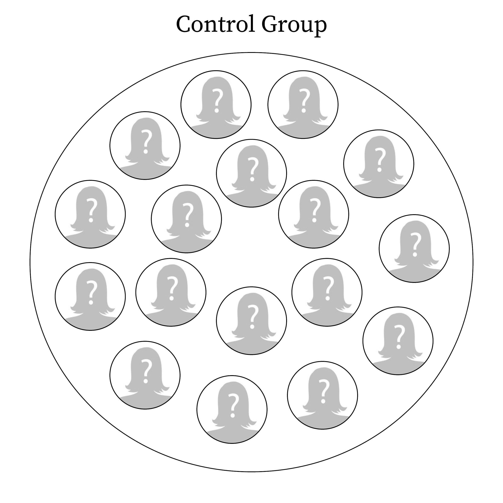
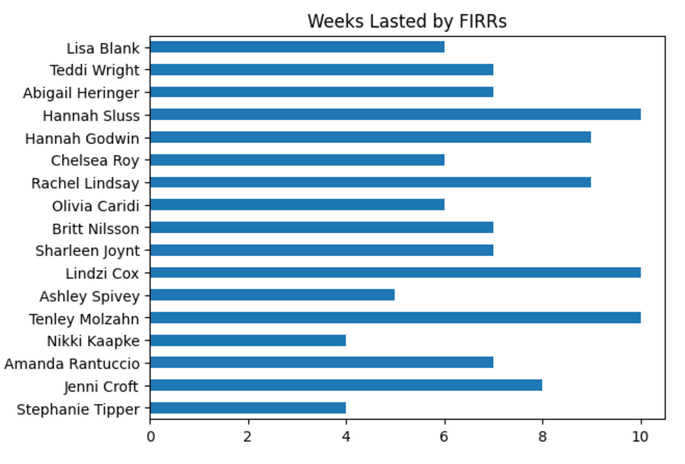
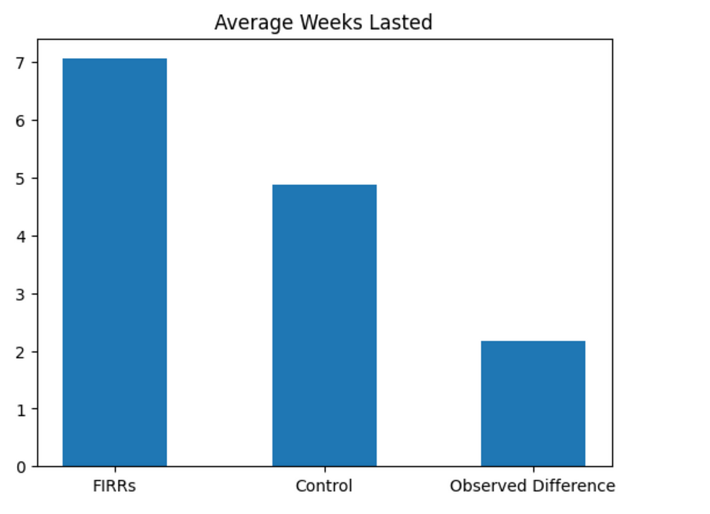
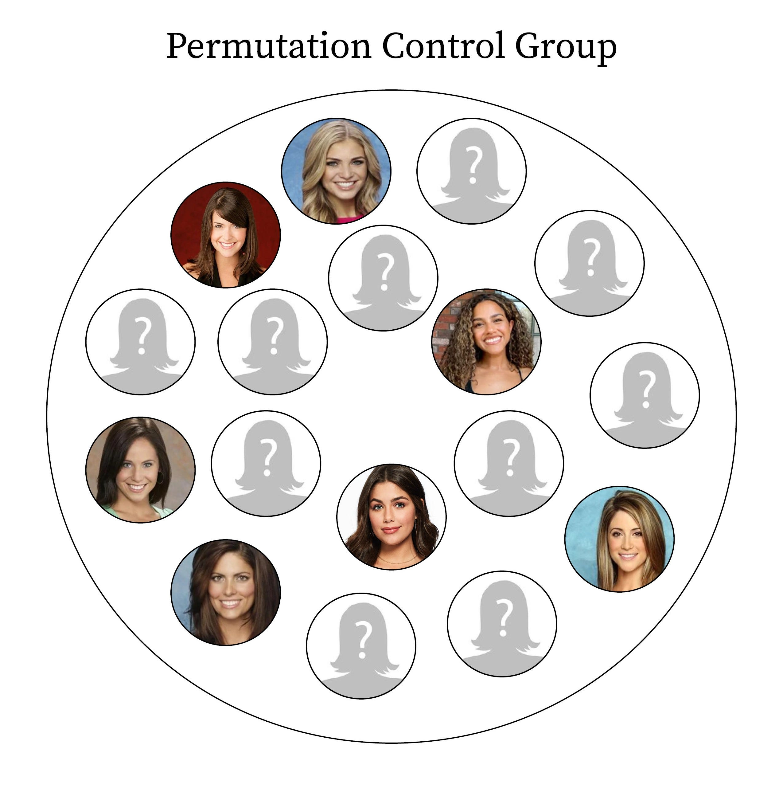
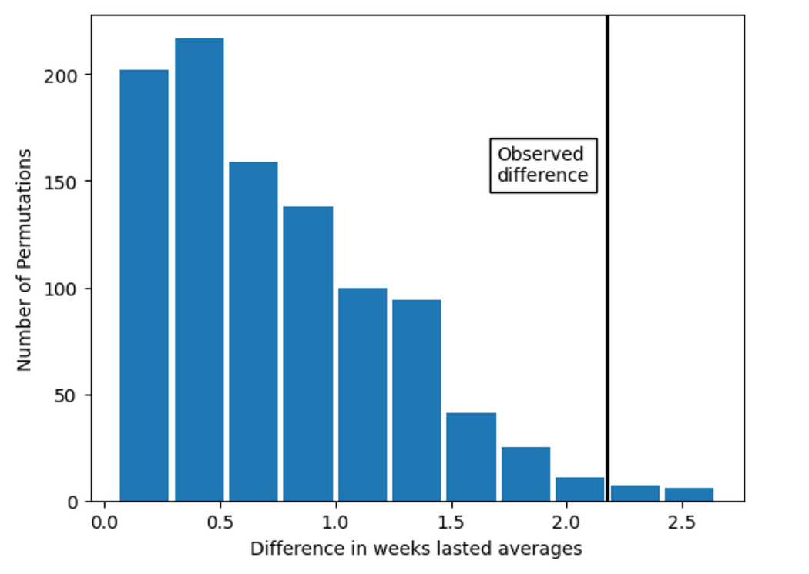

*This is a repost of a Medium article I wrote in January 2023. It was my first attempt at publishing something using data analysis and visualization, and I still think it's interesting. Enjoy!*

---

To my fellow members of Bachelor Nation, Happy Opening Night! To everyone else — have you ever fallen in love at first sight? Then you already have an understanding of the First Impression Rose — the lead off prize in the game that is the reality dating series The Bachelor.

If you've never seen the show but for some reason are tuning in to the premiere of Season 27 tonight, prepare for a bloodbath. You are about to witness contestants battling for a flower, the first flower the Dude In The Suit gives out, a trophy that secures your spot in the running for his love — at least for another week.

While many roses are handed out over the course of the show, there has always been an assumption that the First Impression Rose is special-er than the rest, second only to the Final Rose. Well, in this post, I am going to use data analysis to argue that this assumption is correct, or, to be more technical, that earning the first impression rose is statistically significant in going farther on The Bachelor.

## Statistical Significance

Mine is not the first hot take on First Impression Rose Recipients (FIRRs). In 2017, [Ella Koeze and Walt Hickey for FiveThirtyEight](https://fivethirtyeight.com/features/the-bachelorette/) said that 35% of FIRRs make it to the final episode. In *How to Win the Bachelor (2022)*, Chad Kultgen and Lizzy Pace concluded that 53% of FIRRs have made it to the Final Four.

These percentages, while easy to grasp, are also misleading. For one, the FiveThirtyEight article combines the results of The Bachelor and its counterpart show The Bachelorette, which raises questions considering that only two FIRRs have won the Bachelor versus nine FIRRs who have won the Bachelorette.¹

More importantly, citing a percentage of FIRRs who have made it to final weeks of The Bachelor **does not account for randomness.** In other words, even if we know that 53% of FIRR made it to the Final Four, we cannot tell based on that statistic alone if they made it that far *because* they received the First Impression Rose *or if they were just lucky.*

## Randomization Test

We can, however, begin to see if FIRRs go farther *because* they secured the first impression rose through a thing called a randomization test (getting bored yet? Well I'm starting to question if you're Here For the Right Reasons!). The way this procedure works is by first setting a "treatment" group (in this case the FIRRs) and a "control" group (randomly selected contestants from the same seasons as the FIRRs).²

*Contestants who didn't make it past the first night were excluded from the sample since the FIRRs automatically advance to week 2.*

We then tabulate how many weeks on the show each contestant lasted.³

*Correction: Thanks to /r/theBachelor for pointing out errors in the previous iteration of this graph which are now fixed. Also note that runner-ups receive the same outcome (10) as the winners for this experiment.*

For each group, we then calculate the average weeks lasted and find the absolute difference, which shows how many more weeks the FIRRs lasted than the control group.

*FIRRs lasted about 7 weeks on average, the Control lasted 5 weeks on average, meaning that FIRRs on average lasted about 2 weeks longer on average than another random contestant.*

It looks obvious here that getting the First Impression Rose means that you go farther on the Bachelor, but if we were to stop here we would be making the same mistake of not accounting for randomness! Instead, we go the extra mile by doing what's called a [permutation test](https://www.jwilber.me/permutationtest/), where we randomly shuffle the members of the treatment group with the control group (much like a deck of cards — any Roby Stans in the house? The magician from Rachel and Gabby's season? Anybody?). Then, we go through the same process of finding the absolute differences between the average weeks lasted.

*These permutations are just examples of possible permutations for the two groups, not necessarily exact permutations used for this experiment.*

By doing this over and over (1000 times for this experiment), we can create a graph that shows what the most common differences between the two groups would be if the group each member belonged to was random.

The "Observed difference" line here refers to the difference in weeks lasted on The Bachelor between our starting groups, the actual FIRRs versus random contestants from their same seasons. The important takeaway here is that this observed difference line is *an extreme outcome*. In other words, according to this test is unlikely that it would happen by chance — **a sign that the First Impression Rose matters!**

## Conclusion

Part of the appeal of this show for serious fans is we can see through the fantasy façade and spot the sly plays contestants make between the lines, but the results of this experiment do, in a way, point to some truth at the heart of this wild reality show — that statistically you can feel a connection with someone right away and tell it will last. Well, at least for several weeks until one of your parents says they don't like them, and meanwhile you've fallen in love with two other people, and then you break up with them as a C-list country stars sings a heartbroken melody live in the background…

## References

[My Github repository for this project](https://github.com/gam32bit/firstimpressionrose)

Python Web-scraping with Selenium vs Scrapy vs BeautifulSoup \| Witcher project ep. \#1 by Thu Vu data analytics [on Youtube](https://www.youtube.com/watch?v=RuNolAh_4bU)

Practical Statistics for Data Scientists, Chapter 3: Statistical Experiments and Significance Testing

## Footnotes

¹This is according to the [Bachelor Nation Wiki](https://bachelor-nation.fandom.com/), which does not include results before Season 10. There were first impression roses given out as early as Season 5 by now-host Jesse Palmer, but these results are not recorded on the Wiki, at least not in a structured way.

²For the purposes of keeping data uniform, I decided to start with Season 9 for the FIRRS list because that is the Season where the Wiki pages present full profiles on the contestants. Season 17 was omitted as an outlier where Bachelor Sean Lowe gave out 12 roses on the first night. Wikipedia designates Tierra LiCausi as the legitimate FIRR for this season, whereas the Bachelor Nation Wiki does not make this distinction.

³It should be noted that the seasons of The Bachelor analyzed for this experiment had different lengths: Season 9 was seven weeks, Seasons 10–14 were all eight weeks long, and the rest were ten weeks with the exception of Season 23 [which ended abruptly at 9 weeks.](https://bachelor-nation.fandom.com/wiki/The_Bachelor_(Season_23)) It could be argued that a shorter season means that each week survived would be more significant than weeks survived in the longer seasons, but I decided to keep it simple and just treat each week as equal.
