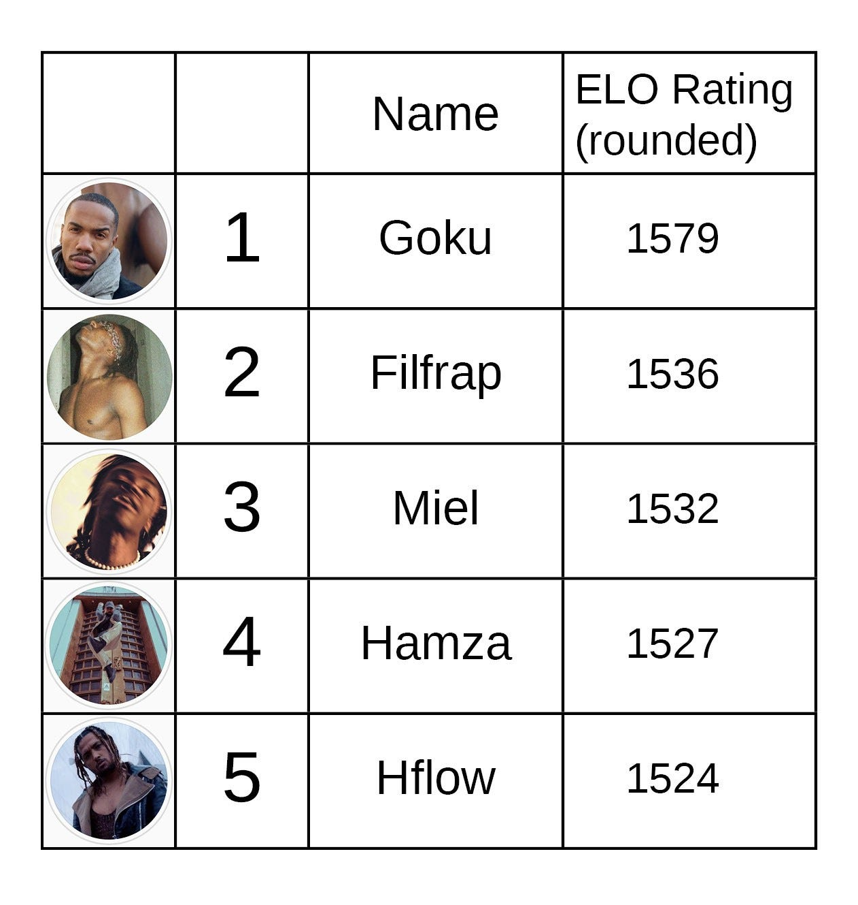
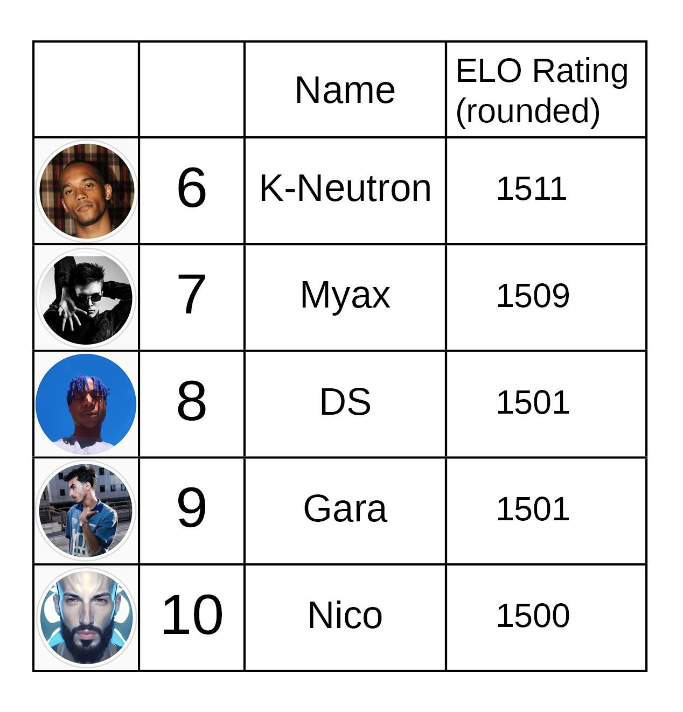
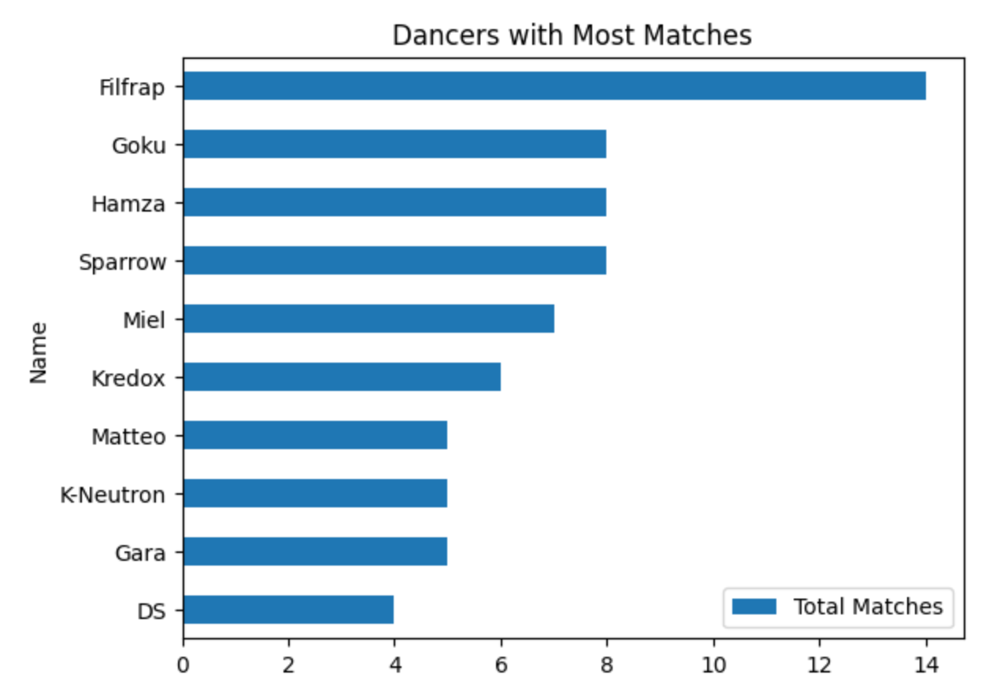

import Figure from '../../../components/Figure.astro';
import frequencyBattle from './frequency-battle.png';

<Figure
  src={frequencyBattle}
  alt="Crowd surrounding two pairs of dancers facing off at a dimly lit rave"
  caption="Goku & Soniaah vs Hamza & Gara at FREQUENCY “NEXT LEVEL” Rave edition."
/>

*Correction: The original version of this analysis did not include one major tournament of 2022. It has since been updated.*

Electro Dance is a competitive style of street dance that originated in Paris electronic clubs circa 2007. The first tournaments were posted online via the then-new platform Youtube, and Electro quickly became an international phenomenon. Electro battles now take place in every corner of the world, from Mexico and Argentina, to Morocco and Spain, to Ukraine and Russia, to Mongolia and beyond.

Despite its widespread popularity for over a decade, there has never been a global ranking system for Electro dancers based on wins and losses. This post takes a preliminary step towards that goal by presenting rankings for Electro dancers in France in 2022 based on an ELO rating system.

### The Top 10

These ratings are based on the outcomes of 5 major Electro events last year in France — My Summer Frequency, Boma Mutu, CitElectro Jam, Klubbing Ephémère, and Le Mood #3 — chosen because the battles were (almost) all included on YouTube, and they all included 1-on-1 battle brackets.¹ Other events such as the Electro Street's Rafale D'Or were not included because the battles were for exhibition and not a bracket format.

The clear front runner out of the French dancers is Goku, undefeated in the pro Electro circuit in 2022, with an ELO rating significantly higher than the rest. Also notable is Filfrap, who competed in the most battles overall, including a unique 1-on-1-on-1-on-1 Final at the CitElectro Jam, which he won.

<iframe width="640" height="360" src="https://www.youtube.com/embed/KPAgwwTdp8w" title="CITELECTRO JAM 2022 : 1 VS 1 INTERNATIONAL FINAL (KTC) — FILFRAP VS KREDOX VS GARA VS DS" frameborder="0" allow="accelerometer; autoplay; clipboard-write; encrypted-media; gyroscope; picture-in-picture; web-share" referrerpolicy="strict-origin-when-cross-origin" allowfullscreen style="display:block;max-width:100%;margin:1.5rem auto;border:0;border-radius:4px;"></iframe>

### ELO Rating system

The ratings number next to each dancer reflects not only their wins and losses, but also who they won and loss against. This system was developed by physics professor Arpad Elo as an improved way of ranking Chess players but can be used in any zero-sum game.

In the program written for this analysis, each dancer who competed in one of the major tournaments was given a base 1500 score to start. Then all of the matches from the 5 major tournaments were evaluated in chronological order. When a match is evaluated in an ELO system, the winner takes points from the loser, and the amount depends on their relative rankings. If a higher ranked dancer defeats a lower ranked one, only a few points are transferred. If the opposite happens, the lower ranked dancer takes a lot of points from the higher ranked one. In other words, upsets score more points, predictable wins score less.²

Due to the total number of matches being low, a slight bump was added to points earned by dancers who had battled at least 5 times previously. Also for the special 1-on-1-on-1-on-1 Final, where the winner of each round would battle the next dancer on deck in the next round, less points were awarded as each round was treated as a mini-battle.

### Limitations of these Ratings

These ratings offer some perspective on the skill of these dancers, but on the whole do not give a completely accurate picture. The biggest flaw is the absence of prior years of battles being included. Many dancers who competed last year are relatively new to Electro but for this study started with the same base score as much more experienced dancers, such as Milliard who is a legend and one of the originators of the Electro Dance style.

The main challenge in gathering this data is that documentation of Electro Dance battles on Youtube is, well, bad. Many battles from tournaments are not uploaded, or do not include who won the battle in the description, or do not even include the word "Electro" in the title or description, making it difficult to find them using a web-scraping tool or Youtube's API.

### Conclusion

There are difficulties in gathering enough information for a more truthful Electro ranking system, but this study of the French Electro 2022 season shows that such a system is possible. In particular, the "Vertifight" series of tournaments which happened early on in the history of Electro were better documented than most and would be a good place to start for a more comprehensive estimation of the best Electro Dancers of all time. In addition to 1-on-1 tournaments, 2-on-2 battles and team battles can also be analyzed.

If you are interested in seeing more Electro rankings, please share this post and let me know in the comments! #electroisnow

### References

[Github repository for this project and full rankings spreadsheet](https://github.com/gam32bit/frenchelectro2022)

### Footnotes

¹The outcomes of missing battles were deduced by the results of other battles.

²The previous version of this post included a paragraph about the biggest upset of the season, but due to the low number of matches the top "upsets" were not accurate and were removed.
