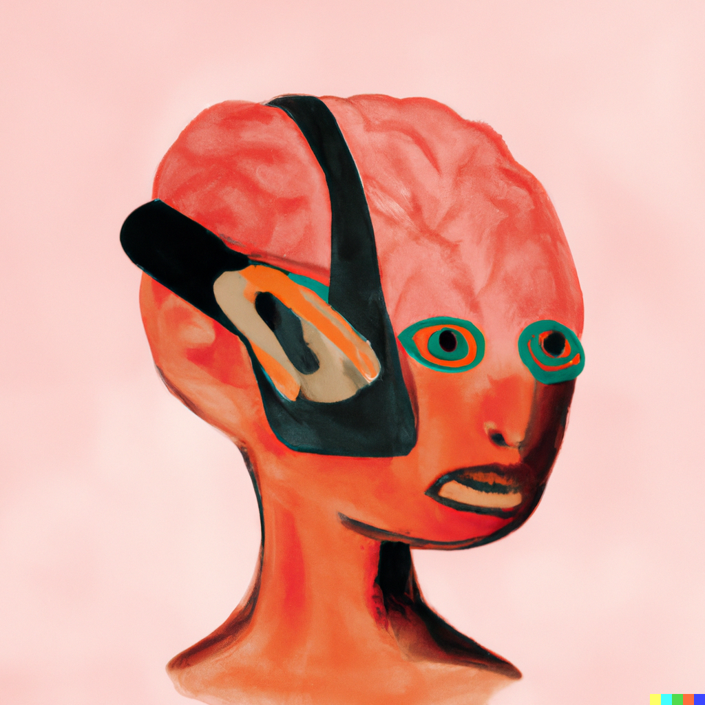
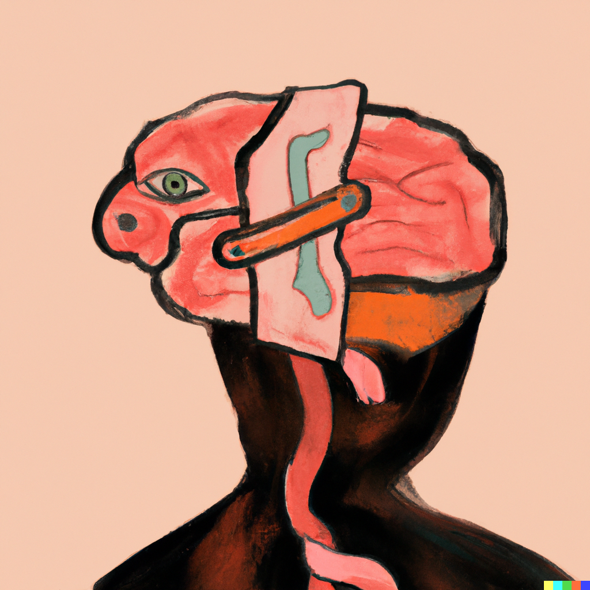
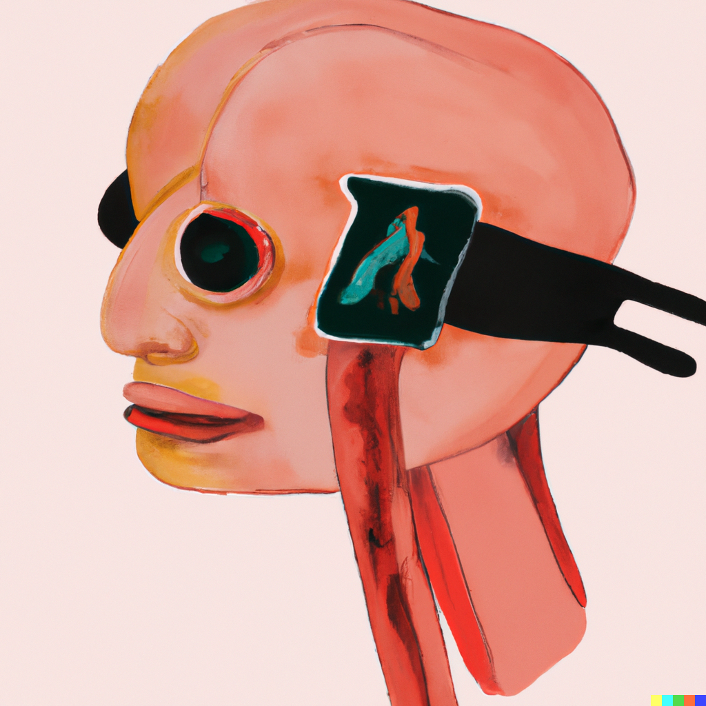
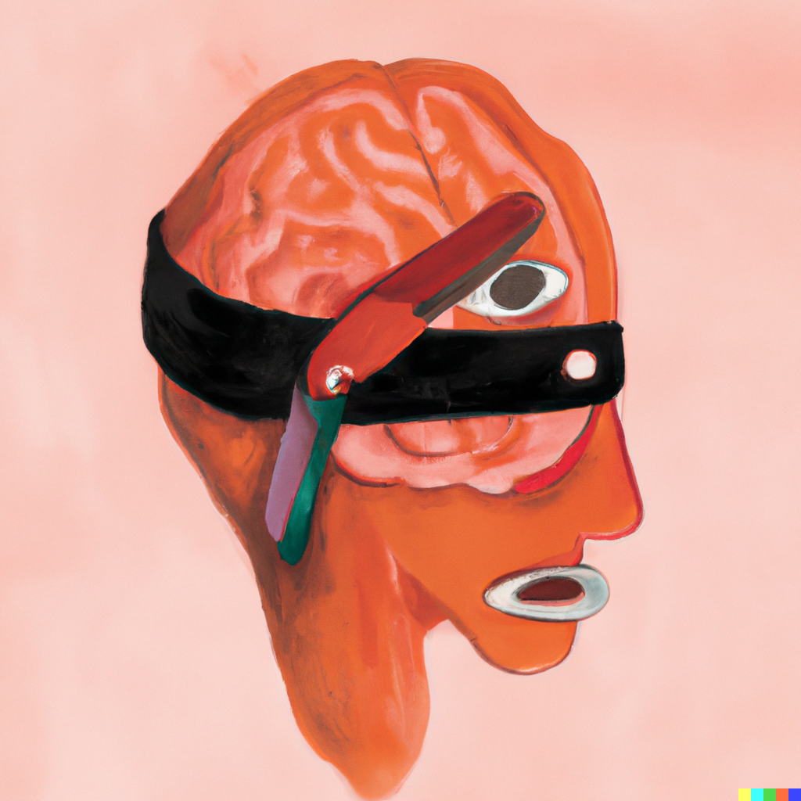

import Figure from '../../../components/Figure.astro';
import dalleBrain1 from './dalle-brain-1.png';
import dalleBrain2 from './dalle-brain-2.png';
import notionDashboard from './notion-journal-dashboard.png';
import journalAppGui from './journal-app-gui.png';



<Figure
  src={dalleBrain2}
  alt="Second Dall-E 2 illustration of a surreal head with an exposed brain"
  caption="Images generated with Dall-E 2"
/>

It's March 17, 2023, and I open my [Notion](http://notion.so/) dashboard to make a journal entry. I write about how my recent move across the country has been stressful but overall okay. I tell myself that anything I find annoying about the new apartment I'll eventually get used to. I remind myself to **always** check rental contracts for exact return times. Then, I exit out of the app and go about my day, but the data I entered remains in the cloud, stored on servers owned by Notion Labs, Inc.

<Figure
  src={notionDashboard}
  alt="Notion dashboard with a journal database, habit tracker, and to-do lists"
  caption="My Journal Dashboard on Notion"
/>

Productivity apps like Notion and [Obsidian](https://obsidian.md/) promise to help users create a ["second brain,"](https://www.buildingasecondbrain.com/) a digital extension of your mind to better organize your personal life. In exchange, users consent to the company's "freemium" pricing model, where sign-up and basic app features are made free so that premium features and subscriptions can be sold to you down the road.

I subscribed to the annual Notion Plus subscription ($47.99) last year, because I wanted to feel more in control. I wanted to better manage my diet and fitness habits, focus on my mental health, and actually get my personal projects done. Notion did make doing all of those things easier, but the second brain I conceived was not wholly mine.

I had never treated Notion like a true diary, because I knew the words I typed in the app didn't belong to only me. Security is not a priority for Notion, who has admitted on social media that the app doesn't use [the strongest form of encryption](https://skiff.com/blog/is-notion-encrypted) because it would slow down the processing time and make it less pleasant to use. Other productivity apps do offer stronger encryption options, but no matter how secure an app is, as a user you are entrusting the app's owner with your personal information.



March 17 was the last journal entry I made in Notion. I had thought about quitting the app before, but the convenience of typing a journal entry versus handwriting was too good to pass up, and I didn't know of any alternative. With the help of Chat-GPT, the new AI chat bot that's been making headlines, I was finally able to code [my own journal program](https://github.com/gam32bit/journal), one that is completely free, private, and stored on my own computer, and it only took me a couple of days to get a working prototype.

<Figure
  src={journalAppGui}
  alt="Simple desktop window with a text area for a journal entry and buttons to save it"
  caption="The GUI for my journal app."
/>

I had toyed around with Chat-GPT weeks earlier after my youngest sister told me about how useful it had been for her work, but I had never used it for coding. I'm not a professional programmer (yet!), but I have taken some online courses and done a couple of data analysis projects. Still, I had never implemented a Graphical User Interface (GUI) before or connected one to a database.

So, I told the chat bot what I wanted to do: write a script in Python (the programming language I know best) that would create a GUI which would allow me to add journal entries to a database. In response, the AI gave me a high-level overview of the steps I would need to take and what options I had.

When I asked for an example of what the code could look like, at first Chat-GPT offered a Python script using Flask, a module for web applications. I asked if there was an alternative to doing a web app, so it offered a different script using a module called tkinter:

```python
import tkinter

# Create the GUI window
window = tk.Tk()
window.title("Journal Entry")

# Create the label and text box for the journal entry
entry_label = tk.Label(window, text="Enter your journal entry:")
entry_label.pack()
entry_text = tk.Entry(window, width=50)
entry_text.pack()

# Create the button to add the journal entry to the database
add_button = tk.Button(window, text="Add Entry", command=add_entry)
add_button.pack()
```

This is only an excerpt of the many lines of code Chat-GPT generated for me that would eventually become my journal app prototype. To be clear, it did not do the job for me — there was a lot of back-and-forth with me asking more questions, and I still had to do some thinking, editing, and debugging to get the app working. What amazed me, though, was how much time I saved and how the AI chat bot had given me a leg up clearing that initial hurdle of self-doubt in believing I could code my own journal app. It would also explain parts of code I didn't understand to help me learn. I was feeling more in control.





The appeal of the second brain approach to productivity is that organizing your personal life in a digital space gives you a level of self-understanding you couldn't attain without it. When that second brain is hosted by a company, however, you are not the only one learning more about yourself. Your virtual gray matter carries in it [cookies, pixel tags, and other technologies](https://www.notion.so/Privacy-Policy-3468d120cf614d4c9014c09f6adc9091#807ffef41d75415aa00376b297fed8b8) that signal to the company and third parties when, where, and how you use the app.

With AI chat assistance, more people will have the option to program their own productivity apps, fashioning a second brain that is more truly theirs. In general, amateur coders no longer need to know as much syntax in a programming language in order to write or navigate a script with Chat-GPT as their guide.

Notion, Obsidian, and other mainstream productivity apps will not be the only proprietary software undermined by an AI-assisted userbase. Many kinds of web applications may second guess using predatory pricing models when more customers are prepared to Do It Themselves.

As I sit today to make a new entry in my private journal app, I still can't convince myself that I'm in total control of my second brain. Even if we do make our own productivity apps, why are we so obsessed with being productive in the first place? Are we the main benefactors of our productivity, even if we have more control over the tools we're using? Are AI chatbots really "liberating" when Microsoft and other companies still dominate AI technologies?

I'll keep my thoughts on these questions to myself, for now.
