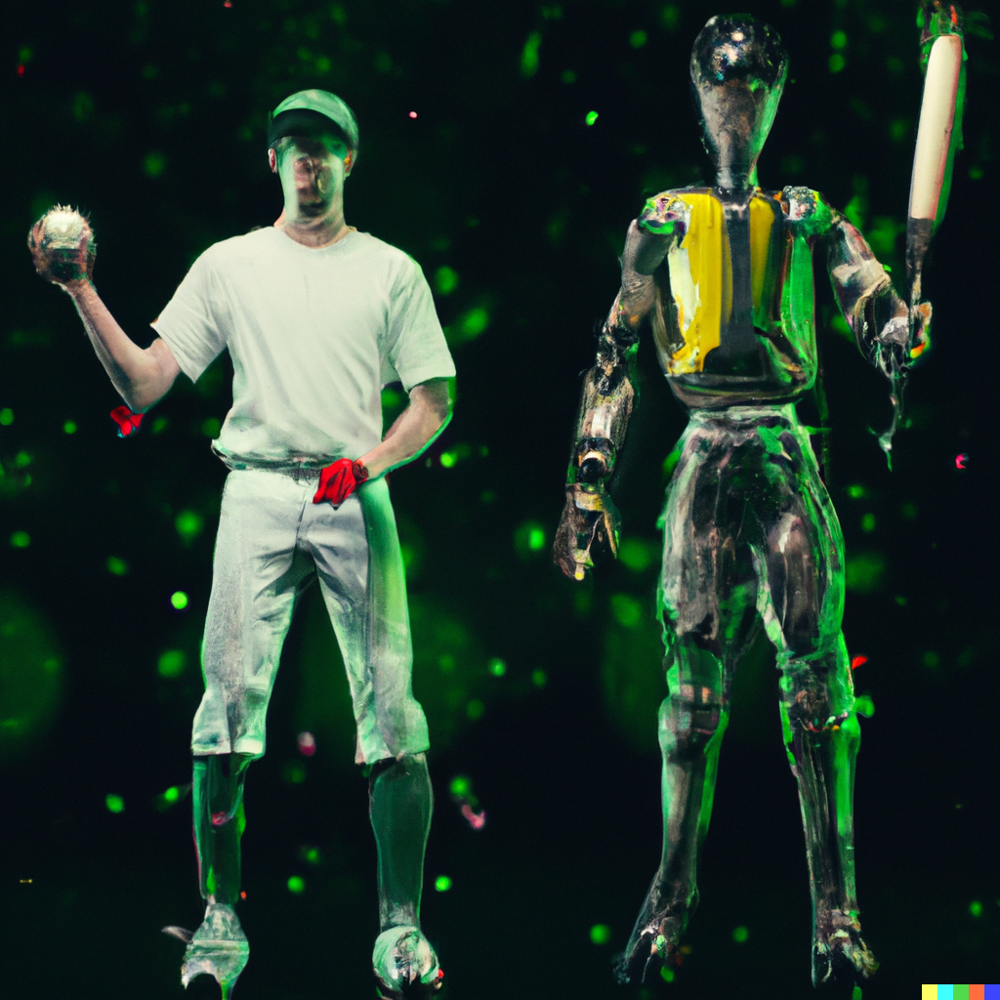

import Figure from '../../../components/Figure.astro';
import dalleCover from './dalle-cover.png';
import triviaGameScreenshot from './trivia-game-screenshot.png';
import triviaGameEndPage from './trivia-game-end-page.png';

<Figure
  src={dalleCover}
  alt="Dall-E 2 illustration of a robot reaching toward a glowing baseball"
  caption="Generated by Dall-E 2"
/>

To the lonely self-taught programmer, it's tempting to think of Chat-GPT as a mentor. The AI language model can do what any good coding coach could — share example scripts, explain technical terms, offer feedback — and if you have no one else to turn to for advice, the Generative Pre-Trained Transformer can start sounding like a friend.

I confess, I am that gullible programmer. While I've never *really* considered Chat-GPT a pal (despite sometimes thanking it absentmindedly), I did obediently follow its lead to deploy my first web application. Don't make my mistake.

### Chat-GPT "Teaches" Me How to Make a Game

To celebrate opening day of baseball season, I wanted to make a [trivia game](http://baseball.herokuapp.com/) that quizzes users on starting lineup players, and I entrusted Chat-GPT to help me navigate the unfamiliar territory of web development. What began as a carefree, magical experience of watching the AI churn out entire scripts of code in seconds slowly turned into a debugging nightmare as the AI struggled to interpret my increasingly complex [codebase](https://github.com/gam32bit/baseballquiz).

<Figure src={triviaGameScreenshot} alt="Screenshot of the baseball trivia game showing a player photo above a text box asking who it is">Spoiler! It's Anthony Rendon ([who recently got physical with a fan](https://www.si.com/mlb/angels/news/angels-news-anthony-rendon-nearing-end-of-lengthy-suspension-ns2002))</Figure>

When I opened Chat-GPT to get started, I had a rough idea of how I wanted the game to work, the programming languages I wanted to use (Python and SQL), and what I wanted the user interface to look like. Users would see a random picture of a baseball player from an opening day starting lineup. Then, they would guess the name of the player and be told whether or not they were correct, and there would be a counter to keep track of their score. After 20 questions, the user would get their final score and have the option to restart.

Based on this simple description, Chat-GPT produced a script using the Flask framework for Python. Wow! It felt like the game was already done! I continued prompting the AI for more code, not stopping to think about the problems that were already beginning to emerge.

```python
from flask import Flask, render_template, request
from flask_sqlalchemy import SQLAlchemy
import random

app = Flask(__name__)
app.config['SQLALCHEMY_DATABASE_URI'] = 'heroku database url'
db = SQLAlchemy(app)

class BaseballPlayer(db.Model):
    id = db.Column(db.Integer, primary_key=True)
    name = db.Column(db.String(100), nullable=False)
    picture_url = db.Column(db.String(200), nullable=False)

@app.route('/')
def index():
    players = BaseballPlayer.query.all()
    random_player = random.choice(players)
    session['current_player_id'] = random_player.id
    session['score'] = 0
    return render_template('index.html', player=random_player, score=session['score'])

@app.route('/submit', methods=['POST'])
def submit():
    player_id = session['current_player_id']
    player = BaseballPlayer.query.filter_by(id=player_id).first()
    guessed_name = request.form['name']
    if guessed_name.lower() == player.name.lower():
        session['score'] += 1
        message = 'Correct!'
    else:
        message = 'Incorrect!'
    return render_template('submit.html', message=message, player=player, score=session['score'])

if __name__ == '__main__':
    app.secret_key = 'secret key'
    app.run(debug=True)
```

### SQL Setback

After I scraped the player names and pictures from the internet, I needed to put them in my SQL database, or so I thought. Chat-GPT told me that I would need to convert the image files into binary code in order to store them in the database table. I followed its instructions to do that, but when I went to make changes to the application, Chat-GPT said loading the images in this way could cause the program to run slow. It recommended storing the images in a folder instead, so I created one.

At this point, I should have questioned why I needed a SQL database at all when it was clearly making everything complicated. It was only later, after receiving input from a friend, that I realized that it would be simpler to keep the player names and image file names in a JSON dictionary instead of using SQL.

Chat-GPT has been known to "hallucinate" and make up facts when it doesn't know the answer, but it also avoids confrontation when responding to a prompt, such as stopping you from using a technology that doesn't make sense for a particular project. Chat-GPT is more like a customer service representative than it is a collaborator. Its goal is to fulfill your request; not to advise.

I toiled over my code for days to get it to work with SQL, assuming that the database was integral to Chat-GPT's design for my project. I would later realize that I was the one who had told the AI that I wanted to use SQL in the first place! Chat-GPT had only accommodated my poor decision-making.



### Failure to Launch

On the morning of Major League Baseball's opening day, the app was working on my machine, and I foolishly thought deployment would be as simple as clicking a "Publish" button. Instead, I couldn't even get the page to load. I shared the error message with Chat-GPT, and it suggested that the problem had to do with my version of Python. I tried adding a runtime.txt file and made other changes it proposed — no luck.

Once I finally got the web app to load, the second error I ran into was with the session instance that stored the user's guesses page-to-page, which was now throwing a key error when I clicked the "Submit" button, as if the instance was empty. I stared at my computer screen for hours trying to figure this out.

The solutions for both the errors turned out to be straightforward: I needed to install a couple more dependencies to get the page to load, and I needed to create a secret key as an environmental variable on Heroku (the hosting service) to dodge the internal server error. I only discovered these fixes after consulting, again, with programmer friends.

### A Bad Coder Blames Their Tools

I can't point the finger at Chat-GPT for these project hurdles. On the contrary, I am grateful for the AI assistance which made this game possible. If I had taken more responsibility for my own program, I could have circumvented these obstacles and deployed the app with much less hassle.

I did a lot of things wrong. From the get go, I didn't think enough about the project requirements, the structure of the code, or the user experience. If I had shared my idea for the game with programmer friends from the beginning, I would have gone into writing the code better equipped to face these challenges.

Teaching yourself to code can feel like a solitary endeavor. Even if you know people who can offer guidance, there's the fear that you're being overbearing in asking for help. That's the appeal of using Chat-GPT as a substitute: you can message it as much as you want, and it never gets annoyed! The drawbacks of replacing human judgement with the text generated by a large language model, of course, should now be obvious.

I didn't want to admit I needed assistance, because I wanted to prove that I had what it takes to be a professional coder, ignoring my own deficiencies. Making things worse, I offloaded the responsibilities of planning, designing, and thinking onto Chat-GPT, duties which it isn't meant to handle.

As it turns out, professional coders *do* ask for help when they need it. Self-taught programmers must do their due diligence in reading documentation, searching for answers online, and problem-solving, but there's no shame in seeking direction from other developers, especially when you're out of your element. Coaching, for now, is still a uniquely human ability.

<Figure
  src={triviaGameEndPage}
  alt="End screen of the baseball trivia game showing the final score with options to restart"
  caption="End page of my baseball trivia game."
/>
