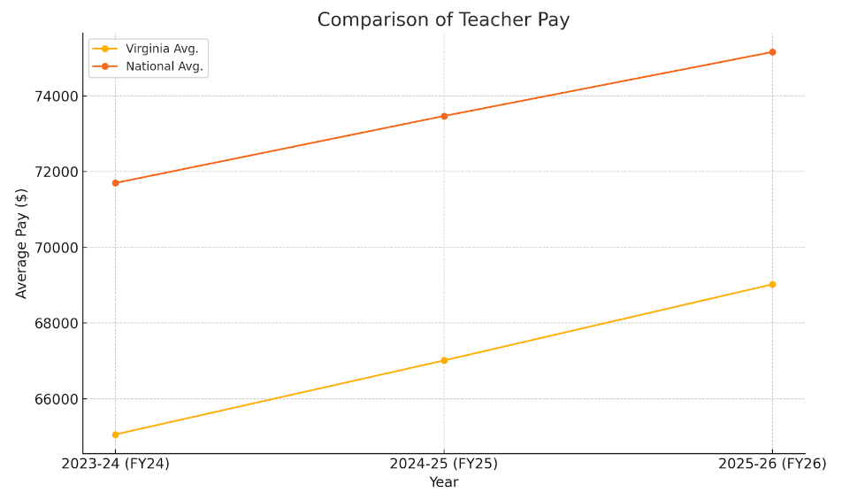
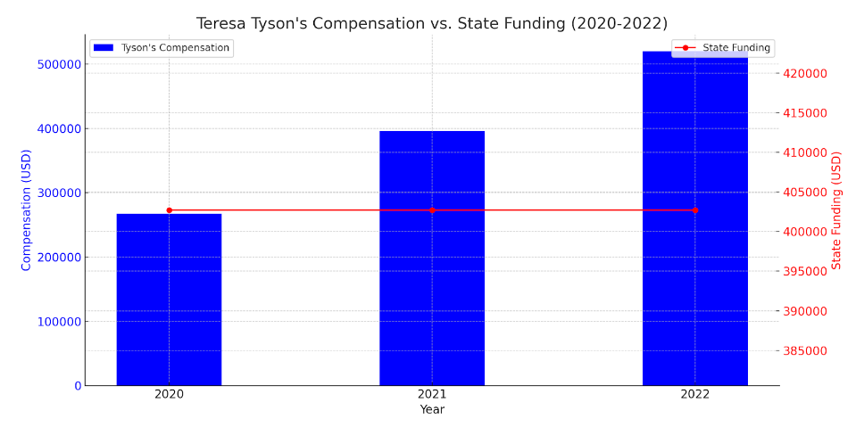
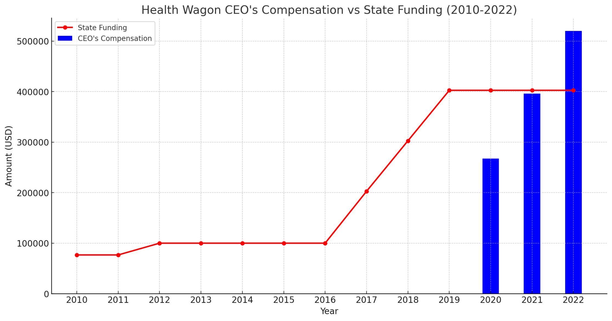

import Figure from '../../../components/Figure.astro';
import flockMapGuide from './flock-map-chatgpt-guide.png';
import flockMapFinal from './flock-map-final.png';
import aiePieChart from './aie-pie-chart.png';

I haven't used Excel to create a graph in years. Okay, I'm exaggerating. But it is a pain! I won't make graphs even when they would enhance a project or report, just to avoid Excel's mish-mash of buttons and dropdown menus.

Not anymore. Now, I make graphs all the time! That's because I can tell ChatGPT what I want and create something in minutes.

If you're not in the habit of using ChatGPT ([most people aren't](https://reutersinstitute.politics.ox.ac.uk/what-does-public-six-countries-think-generative-ai-news)), all you have to do to create a graph is give the chatbot the data you want visualized, tell it what kind of graph you want, and within seconds you'll have a draft. From there, tell it what corrections you want to make, and with a little back-and-forth conversation, you'll have a final product. That's it.

Let me take you through a few use cases when I've created data visualizations with ChatGPT to enhance [my journalism projects.](https://www.roundthetriangle.com/)

### 1. VA Teacher Pay Below US Average

Last month, the Virginia Education Association condemned Gov. Glenn Youngkin's [veto of two bills](https://www.veanea.org/vea-statement-on-veto-governor-standing-up-for-confederacy-and-sitting-down-for-teachers/) intended to raise Virginia teacher pay to the national average. In a press release, the VEA [cited data](https://www.nea.org/sites/default/files/2024-04/2024-rankings-and-estimates-report.pdf#page=44) from the National Education Association showing that, contrary to Youngkin's claims, the average VA teacher pay was indeed below the national average.

| Year | Virginia Avg. | National Avg. |
| --- | --- | --- |
| 2023-24 (FY24) | $65,058 | $71,699 |
| 2024-25 (FY25) | $67,010 | $73,466 |
| 2025-26 (FY26) | $69,020 | $75,156 |

But what does this pay gap look like visually? You tell me! Copy the numbers from the table above, and paste them into [ChatGPT](https://chatgpt.com/) (it's free and you don't need to create an account) and ask **"Can you make a graph of this table comparing teacher pay?"**

In a few seconds, you'll get something like this:

Not bad! With this visualization, it's easier to see that VA teacher pay is not only lower than the national average, but the gap has barely been closed at all in the past few years.

### 2. Health Wagon Woes

Rural Virginia has [healthcare deserts](https://virginiamercury.com/2023/11/13/in-rural-virginia-communities-struggle-to-find-enough-health-care-workers/), and mobile clinics have tried to provide better access to care for those communities. The [Health Wagon](https://virginiamercury.com/2019/09/20/remote-health-clinic-returns-to-lee-as-hospital-prepares-to-reopen/) has earned state dollars over the years as they've led the charge in this effort. That state funding, however, ran dry last month, after the news that CEO Teresa Tyson had nearly [doubled her compensation in two years](https://cardinalnews.org/2024/05/02/ceo-of-free-clinic-serving-appalachia-saw-pay-package-nearly-double-over-2-years-tax-forms-show/).

Using the numbers from [this Cardinal News story](https://cardinalnews.org/2024/05/11/legislators-slash-more-than-800k-in-funding-for-health-wagon-amid-reports-ceos-compensation-package-nearly-doubled-in-two-years/), you can ask ChatGPT to create a bar graph of the Health Wagon CEO's annual compensation compared to the amount of state funding the nonprofit received and get something like this:

Whoa, two y-axes? That's confusing. No problem – **you can follow up and request that ChatGPT make the graph stretch back to 2010** and tell it to keep it to one y-axis, please.

Now that's a better visual! The uptick in state funding is nearly parallel with the bump in the CEO's pay a couple years later, which wasn't easily perceptible from the numbers alone.

### 3. Flock Cameras in Hampton Roads

The Virginian-Pilot recently started a new series on [mass surveillance in the Hampton Roads area](https://www.pilotonline.com/2024/05/24/one-nation-under-watch-new-brand-of-largely-unregulated-mass-surveillance-is-expanding-in-virginia/) and included the number of automated license plate readers, or flock cameras, operated by various local law enforcement agencies.

ChatGPT can't produce a map visualization on its own (at least not when I've tried), but you can ask it to produce Python code that will.

<Figure
  src={flockMapGuide}
  alt="ChatGPT conversation showing a step-by-step guide using the Folium Python library: installing Folium, preparing the camera data, and creating the map"
  caption="Step-by-step guide on how to create map visualization program for Flock Camera data."
/>

Set up [a repo on GitHub](https://docs.github.com/en/repositories/creating-and-managing-repositories/quickstart-for-repositories), enable [GitHub Pages](https://pages.github.com/) (all free), and deploy the map visualization in no time. Like any programming project, there will be some debugging involved, but [ChatGPT makes that easier as well](https://www.w3schools.com/gen_ai/chatgpt-4/chatgpt-4_code_debug.php).

<Figure
  src={flockMapFinal}
  alt="Map of Hampton Roads with labels showing the number of Flock cameras operated by each local law enforcement agency"
  caption="The final product!"
/>

### When in doubt, try ChatGPT out!

ChatGPT's not perfect. After I started writing this post, I tried using the chatbot to create a pie graph for a report on the [Aquaculture Information Exchange](https://www.linkedin.com/showcase/aquaculture-information-exchange/), but it had trouble making it exactly the way I wanted.

For the first time in years (kidding), I begrudgingly loaded up Excel to create the pie chart. It didn't take as long as I thought it would, but it was still annoying.

<Figure
  src={aiePieChart}
  alt="Pie chart of AIE membership split among students, industry professionals, federal and state agencies, growers and hatcheries, extension, researchers, and nonprofits, educators, and consultants"
  caption="Made in Excel"
/>

This case, however, is the exception to the rule. Overall, ChatGPT is an easy and rewarding way to create data visualizations. I hope you try making some with [ChatGPT](https://chatgpt.com/) yourself!
