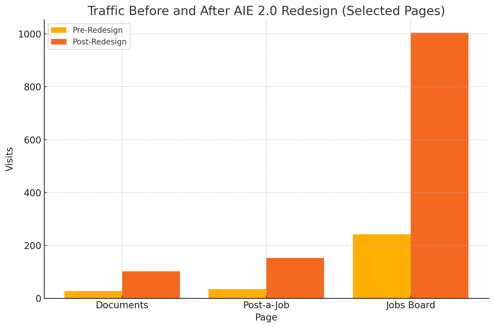

import Figure from '../../../components/Figure.astro';
import surveyFeedback from './survey-feedback.png';
import aie10 from './aie-1-0.png';
import aieGroupsDirectory from './aie-groups-directory.png';
import aie20 from './aie-2-0.png';
import aieFeaturedGroups from './aie-featured-groups.png';
import trafficChart from './traffic-chart.png';

In October 2023, I joined **Virginia Sea Grant** to manage and develop the **Aquaculture Information Exchange (AIE)**, a NOAA- and USDA-backed online platform for the American aquaculture community.

As a daily user, I quickly got used to navigating the site, but I started to wonder if the learning curve was the same for weekly or monthly users.

In June 2024, I conducted a **member survey** to find out. While many respondents gave positive feedback, several had found the site layout confusing:

> "took a bit to understand the format and how to navigate"

> "Navigating was a bit difficult"

> "just doesn't seem user-friendly"

Even among users who *did* say they were comfortable navigating, many had never used some of the AIE's core features, like our educational courses or jobs board.

**This wasn't just a navigation problem—it was a discoverability problem.**

With a surge of new AIE members expected at the March 2025 **Aquaculture Triennial conference**, I saw an opportunity to fix these issues beforehand. My goal was to make it easier to get around the AIE and understand everything the platform had to offer.

<Figure
  src={surveyFeedback}
  alt="Survey responses describing the AIE site layout as confusing to navigate"
  caption="From the June 2024 AIE Member Survey"
/>

## The Redesign

At launch, the AIE had six top-level menu items: Home, Courses, Groups, Members, Events, and Jobs and Funding.

Aside from being visually crowded, the tail-end menu items would also get cut off on smaller screens.

Key features like Groups and Courses were accessible with this layout, but when members clicked through, they were presented with unfiltered directories that could feel overwhelming, especially for new users.

<Figure
  src={aie10}
  alt="The original AIE home page with six top-level menu items in the header"
  caption="AIE 1.0"
/>

<Figure
  src={aieGroupsDirectory}
  alt="The AIE groups directory showing a long unfiltered list of groups"
  caption="AIE Groups Directory"
/>

To address the congested header menu, I conceptualized organizing features into two main header menu drop down hubs: **Connect** and **Learn**. Connect would contain groups, the membership directory, and events, while Learn would include our webinar series, courses, and documents.

Instead of dumping users into unfiltered directory pages, each menu item would open a curated landing page, spotlighting a featured example and offering categories to help users browse.

<Figure
  src={aie20}
  alt="The redesigned AIE home page with Connect and Learn dropdown menus in the header"
  caption="AIE 2.0"
/>

<Figure
  src={aieFeaturedGroups}
  alt="The new Groups landing page spotlighting a featured group with browseable categories"
  caption="AIE Featured Groups"
/>

Once we had the new design set up on a staging site, we invited several members to test the new layout and give us feedback. One suggested moving the "View All" links to the bottom of each landing page so users could explore the categories first, which we implemented.

## Launch and Results

On March 3, just before the Aquaculture Triennial conference, we launched **AIE 2.0**.

In the eight weeks that followed, sitewide traffic **more than doubled**:

- **Sessions** increased from 2,073 to 4,188 – up **103%**
- **Pageviews** rose from 9,132 to 19,351 – up **112%**

Some of the largest gains came from neglected features that the redesign had aimed to make more visible:

- **Documents database** from 28 to 102 – up **264%**
- **Post-a-job** page from 35 to 153 – up **337%**
- **Jobs & Funding board** from 242 to 1,004 – up **315%**

While some of the prominent features pre-redesign continued to do well like the Groups directory (up 217%), our Courses saw a decrease in traffic of 47%.

Courses had previously been the first header menu item after the Home page, but with AIE 2.0 it was the second item in the Learn dropdown. While this made sense under the new architecture, it did push the Courses feature more out of sight.

Overall, however, we received positive feedback from users, with one emailing, "the new site looks great!", and another, "the changes you've made will make it easy to navigate and find what you're looking for as the website grows."

### What I Took Away

1. **Small UI changes can have outsized impact.** Even reordering a menu can dramatically shift what users pay attention to, like the Jobs board in this case.
2. **UX changes often involve tradeoffs.** Making a menu tidier can have unintended consequences, like how our Courses page saw reduced visibility.
3. **Discoverability matters as much as navigation.** It's not enough for users to know how to get around the website. They also need to understand what is being offered.

This redesign improved how users navigate the AIE and helped highlight features that had previously been overlooked. There's still work to do—especially around features like Courses that saw a drop in traffic—but we now have a more flexible, scalable structure in place.

I'm already planning the next redesign of the platform as we continue to add more features. This first attempt provides a solid foundation to build on.

### Tools used:

- WordPress (BuddyBoss)
- FluentForms
- Google Analytics 4 (MonsterInsights)
