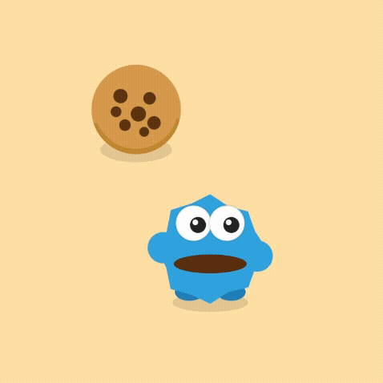
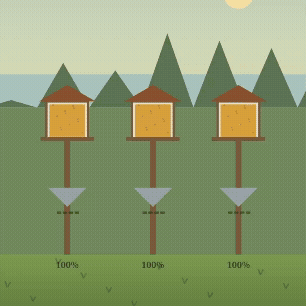
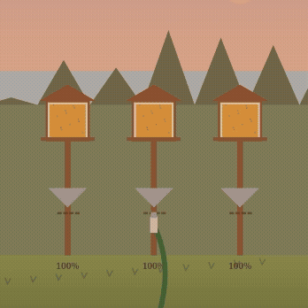
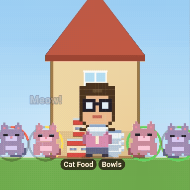
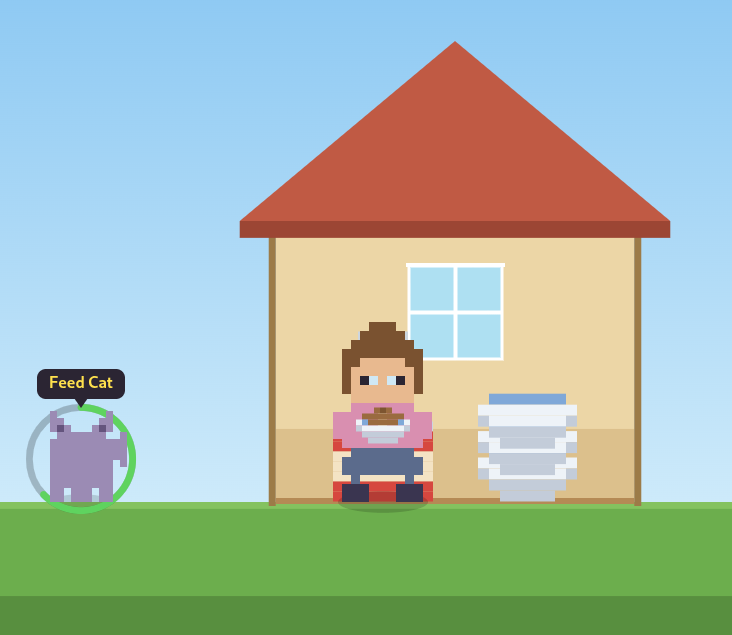

My latest addiction with AI is spinning up little video games for my family. I've been interested in learning how to make games for a long time, but the barrier to entry always felt too high. But now with Claude, my AI tool of choice, I've been able to dive in headfirst.

Are my games good? Hell no. Did they bring a little joy to my family? Totally. 

Until now, I hadn't shared these with anyone outside my family and friends, so I do feel a little ashamed that I'm contributing to the heap of AI slop by promoting them publicly. 

At the same time, to me these AI HTML games do have a charm that reminds me of old flash games on the early internet. And they were fun for me to make.

I realize that all of the same obstacles that turned me away from game design are still there in terms of making something a lot of people could play, that would be reliable and polished. AI just makes it easier to prototype. For now that's good enough.

## Cookie Monster game for my son

The first game I made with Claude was for my toddler. I had the idea of creating something very simple he could interact with on my phone. He was going through a Sesame Street phase, so that idea took the shape of a Cookie Monster-like character chasing down and eating cookies that appeared on the screen.

While I believed that Claude could help me create this game, I expected it would still take some work from me, maybe a week's worth. To my surprise, I was able to get a working game in a couple hours, in the time it took my son to take his mid-day nap.

[For my first prompt,](https://claude.ai/share/bdeb9963-81c4-48ee-960b-70f90c3a1031) I explained the concept to Claude (in the regular chat interface) and asked it to help me think through the game design. The model asked some follow-up questions about the target age demographic, how many cookies should be on the screen at once, and whether Cookie Monster should run to each cookie or teleport. I gave it my answers, and it produced the first iteration.

I was impressed that the game already felt close to what I had been envisioning. I told the AI to go from a one-dimensional movement plane to two and use a simple background. The only other addition was  a sound bite of the classic "OM NOM NOM" to play each time the character ate a cookie. It was finished!

I've made a couple games for my son since then, but this is the only one that he's asked to play again. Creating something that he enjoyed and getting to see him interact with the game in the way I intended sparked something inside me that started me down this AI game dev rabbit hole.

## Protecting birdfeeders from squirrels game for my wife

The next game is one inspired by my wife's frustration with squirrels stealing birdseed from our birdfeeders in the backyard. 

Same as with the Cookie Monster game, [I explained the concept to Claude](https://claude.ai/share/f0ce65ec-32df-40f0-ab2d-fa091d6b2ae2), but this time I skipped the thinking through part and went straight to asking it to create the game. Perhaps that was a mistake. I do think that with using AI you have to be careful not to slip into a mindset of wanting to rush through everything.

Nevertheless, the prototype it came up with was solid. I added some elements like baffles being a line of defense, the rate of squirrels increasing as game goes on, and the appearance of giant squirrels at a certain point. 

I thought this iteration was ready to share with my wife. She liked it and definitely enjoyed decimating the squirrels (maybe too much??), but the game itself turned out to be too easy.

To dispatch the squirrels, all you had to do was tap the screen. It was easy for my wife to keep pace doing this with the rate at which they appeared. I told Claude the game was too easy, so it increased the squirrel rate, made them do more damage to the birdfeeders, and added "sneaky squirrels" that moved faster. Even after all these changes, it was still not challenging.

That's when I came up with the idea to change the core mechanic. I figured that it would be hard to keep up with the squirrels on different parts of the screen if you had to drag your thumb rather than just tapping. Along these lines, I told Claude to have the player use a water hose to attack the squirrels and make it possible to deal friendly fire to the birds that came to eat on the birdfeeders.

It spun up a new version with the hose, but the area of effect didn't seem to be quite right. I decided to move off the chat interface and create a GitHub repo so I could work on this with Claude Code. It was able to get the hose working right, but now the game was too difficult! The pendulum had swung the other way.

To mitigate, I decided to create multiple levels with increasing difficulty in the form of more squirrels, etc. I let my wife play again and she had fun, but as the player she instinctually wanted to be able to refill the bird feeders in some way. I liked that idea and got Claude to implement, where by holding your thumb on the birdfeeder it would refill.

By this time, my wife was a little tired of being my game design guinea pig, and it was becoming more about me wanting to improve the game then the original intention of her having fun, so I stopped working on it. While short-lived, this experience was educational as my first foray into thinking about game mechanics and how changing them could reshape difficulty.

You can [play the game for yoursel](https://gam32bit.github.io/squirrel-game/)f if curious.

## Feeding cats game for my mom

Last game I'll mention is one I made for my mom for her birthday. Like any lovable grandma, she has a habit of bringing out food for the stray cats in her neighborhood, so of course I had to make a game about it.

This time I created a [GitHub repo](https://github.com/gam32bit/meowmeow) from the get go and did the first prompt in Claude Code. I gave the AI the reference of Overcooked in terms of the vibe I was going for and the scramble to get food out to multiple customers quickly. My family also has a dark sense of humor, so I instructed the agent to make the cats explode if they didn't get their food after their timer ran out.

The main problem in developing this game was the art. Claude's first attempt at creating sprites of my mom and the cats was...rough. I had given it descriptions of how I wanted them to look, but what the model came up with was freaking weird, almost alien. Very much what you'd expect a machine to come up with. There were other issues with the first iteration in terms of timing, explosions not being big enough, but the visuals were the main thing keeping it from being shareable.

To fix this, I tried giving the AI more references for what I wanted the visual aesthetic to be, including the Exploding Kittens board game cover art, and other pixel games like Risk of Rain and Noita. These just seemed to make things worse. I eventually got the cats to an acceptable look, but my mom still didn't look anything like herself, and the whole game was sort of centered on her likeness.

I didn't feel comfortable giving Claude a picture of my mom, so what I ended up doing was editing a photo of her in Photoshop and pixelating it to an extent that the basics of her face were still there but the details were gone. This did the trick!

For future games I think the safer bet for sprites is just to purchase sheets rather than using AI to build them. In any case, the game made my mom laugh and I got my other siblings to play it as well.

## Final Thoughts

Reflecting on these little game experiments is validating in that it makes me realize that making these has taught me something, and I haven't just been messing around. The lessons are pretty basic: keeping things simple, playing with different game mechanics to alter difficulty, knowing how to get the AI to produce character sprites with fidelity - but still valuable. 

Since I started writing this I've worked on more ambitious game projects like creating a 3d game where an avatar of my son rides his tricycle around a neighborhood inspired by ours. But it slowly dawned on me that he isn't that interested in playing games on my phone, so I stopped working on it.

Instead, now I'm thinking of creating a physical interactive toy for him. I've got an arduino and rasperry pi lying around, and I have access to a 3d printer. We'll see what I can do.
